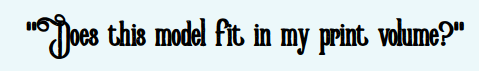

## Line Collision Detector

Hangprinters have lines that point downwards to fixed anchor points during print.
That means than Hangprinter users must plan carefully, so the lines never touch the already printed material during a print.
This program should let Hangprinter users verify that lines will or will not collide with the
print, before pressing print.

Here's a visualisation of where my HP's lines would touch, if it tried to print a 980 mm tall Benchy:


The purpose of this project is not to make fancy visualizations, but to give Hangprinter users
a quick answer to the question



The above gif was made with Openscad and `demo-and-algorithm-outline.scad` found in this repo.
Unfortunately, Openscad is not a practical solution, since it requires a very clean and very small mesh
to be able to perform the required analysis.

Creating the above gif took me (tobben) ~1h, including cleaning and reducing the mesh.
When modelling, we want an answer within seconds.
That is why I've made a from-scratch analysis tool, written in C++20.
It is found in the linc subrepo.

## Status
Should work.

Code is written and tested a few times.
There are no known bugs, but there might be bugs.

## Quick Get Started
First install Docker. See [Docker's own instructions](https://docs.docker.com/get-docker/).

Fetch And Run The Development Image:
```
$ ./docker-shell.sh
```

Compile The Binary:
```
# cd /line-collision-detector/linc
# faster
# b
```

Run The Binary:
```
# run
```

It will tell you how it wants to be used.

If something didn't work, see [troubleshooting](#troubleshooting):

## How to Build Trust in the Computed Result

If you get collision detected:
Use the -o flag and generate a debug model.
Inspect this model in any other program that can visualize stl files.
Confirm visually that a detected collision is indeed a collision.

If you get no collision detected:
Scale up your model gradually until you get collision detected.
Inspect the collision with -o.
Convince yourself that any smaller version would avoid collision.

## More In Depth Info For Developers

### Structure

This project has a Docker environment in which it compiles and runs.
The Docker project lives in this (`line-collision-detector`) directory.

One level deeper, that is inside `line-collision-detector/linc`, we have a build2 project defined.
The build2 build tool, and its norms, dictates the structure and contents of that folder.
See [Canonical Project Structure](https://build2.org/build2-toolchain/doc/build2-toolchain-intro.xhtml#structure-canonical)
in the build2 introduction.

Yet another level deeper, inside `line-collision-detector/linc/linc`, is the actual source.

### Compilation database
If you need the compilation database (`compile_commands.json`), this can
be generated within the Docker container with the following command:
```
# make-compilation-database
```
It actually creates two versions:
```
/line-collision-detector/compile_commands.json # with absolute paths
```
... as required by the `./tidy.sh` script. And also
```
/line-collision-detector/linc/compile_commands.json # with relative paths
```
... as required for running tools on your native machine.
For example, you may start for example an rtags server (a c++ code indexing tool) on your native machine like this:
```
$ cd linc
$ rdm &
$ rc -J .
```
### Indent your code
In a docker shell, from anywhere, do
```
# indent
```
This will indent both c++ code and Bash code in this repo.

### Tidy your code
In a docker shell, from anywhere, do
```
# tidy
```
If you only want to tidy one file, give the filename as an argument

This will check the c++ code and complain about places where we break our tidy-rules.
It will also apply fixes automatically where it can.

### Build and run all tests
In the Docker shell, do
```
# t
```

### Build Docker Image Locally
The `docker-shell.sh` script uses an "official" Docker image that it fetches from [here](https://gitlab.com/hangprinter/line-collision-detector/container_registry).
You might want to build the Docker Image yourself, for example if

 - The official image is outdated.
 - You have local changes in the Dockerfile.
 - You don't trust the official image.

You build your own with:

```
$ ./build-docker.sh
```

### Troubleshooting

#### Buildfile doesn't exist
The linc submodule hasn't been updated.
On the host system, do this:
```
$ git submodule update --init --recursive
```
... and try to compile again.
